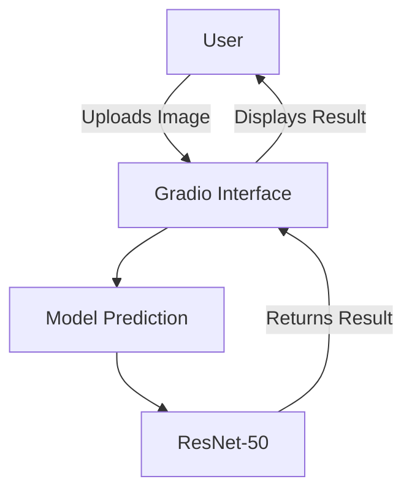

```markdown
<!-- Capsule Render Header -->
<div align="center">
  
</div>

<!-- Typing SVG -->
<div align="center">
  
</div>

<!-- Badges -->
<div align="center">
  
  
  
  
</div>

<!-- Mermaid Diagram -->


<!-- Performance Metrics Table -->
| Metric              | Value                       |
|---------------------|-----------------------------|
| Model               | ResNet-50                   |
| Top-5 Accuracy      | 91%                         |
| Dataset             | CUB-200                    |
| Deployment Platform  | HuggingFace Spaces          |

<!-- Quick Start -->
## Quick Start
1. Clone the repository:
   ```bash
   git clone https://github.com/alam025/bird-classifier.git
   ```
2. Install the dependencies:
   ```bash
   cd bird-classifier
   pip install -r requirements.txt
   ```
3. Run the application:
   ```bash
   python app.py
   ```

<!-- Tech Stack -->
## Tech Stack
<div align="center">
  
  
  
  
</div>

<!-- Capsule Render Footer -->
<div align="center">
  
</div>
```